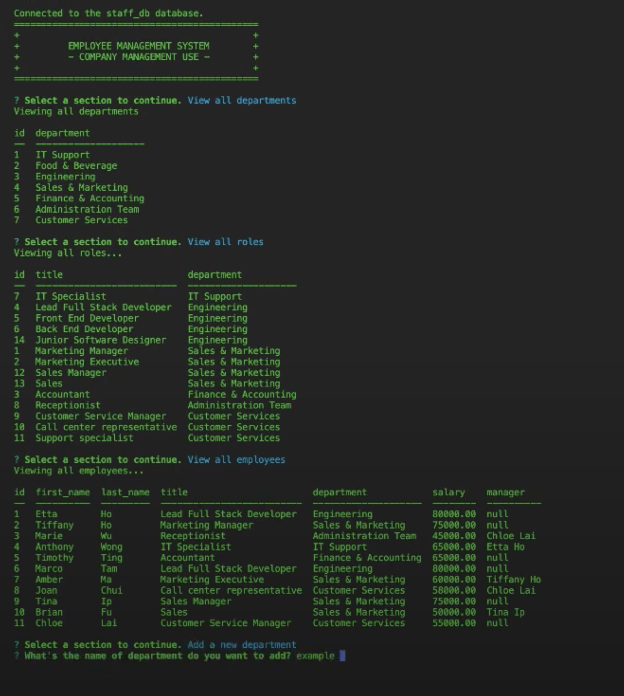
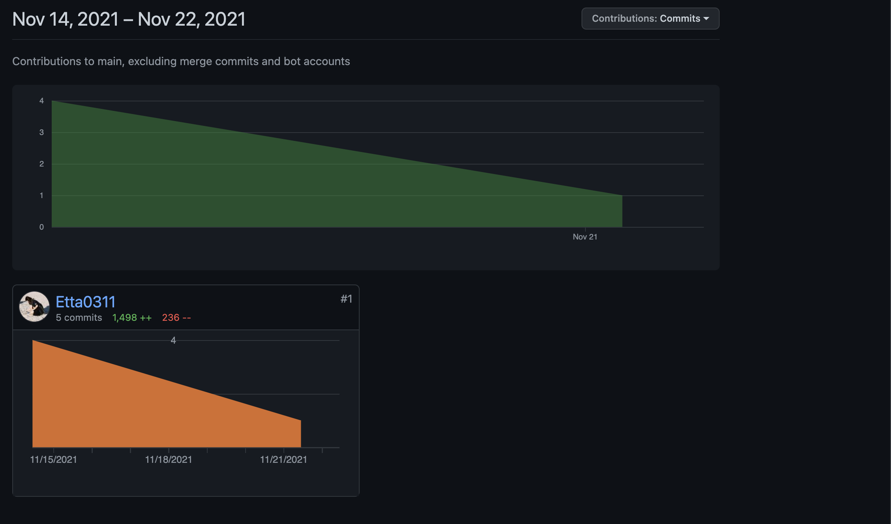

# Employee-Tracker
week 12 assignment -- Employee tracker 
## Table of Contents

- [Description](#Description)

- [Techniques used](#Techniques-used)
- [Installation](#Installation)
- [Usage](#Usage)
- [Contribution](#Contributors)
- [Contacts](#Contacts)
- [Licenses](#Licenses)

## Description
    Employee tracker is designed as a company used application, which saved all the employee profile, showing departments and manager are they in and follow. 
    Not only to view thier info but also able to update & delete previously saved employee profile.

## Techniques used

    - Javascript
    - Node.js

## Installation
1. Git clone this repository to your desktop
2. Open your coding editor and run commands
```
npm install
```
```
node server.js
```
## Usage
View the full DEMO video on YOUTUBE.
[Demo](https://youtu.be/_T1Yjqht9PM)


## Contributors



## Contacts
For any questions, Please reach me via [email](mailto:etta0311031@gmail.com).


## License
MIT License

Copyright (c) [2021] [Ettaho]

Permission is hereby granted, free of charge, to any person obtaining a copy
of this software and associated documentation files (the "Software"), to deal
in the Software without restriction, including without limitation the rights
to use, copy, modify, merge, publish, distribute, sublicense, and/or sell
copies of the Software, and to permit persons to whom the Software is
furnished to do so, subject to the following conditions:

The above copyright notice and this permission notice shall be included in all
copies or substantial portions of the Software.

THE SOFTWARE IS PROVIDED "AS IS", WITHOUT WARRANTY OF ANY KIND, EXPRESS OR
IMPLIED, INCLUDING BUT NOT LIMITED TO THE WARRANTIES OF MERCHANTABILITY,
FITNESS FOR A PARTICULAR PURPOSE AND NONINFRINGEMENT. IN NO EVENT SHALL THE
AUTHORS OR COPYRIGHT HOLDERS BE LIABLE FOR ANY CLAIM, DAMAGES OR OTHER
LIABILITY, WHETHER IN AN ACTION OF CONTRACT, TORT OR OTHERWISE, ARISING FROM,
OUT OF OR IN CONNECTION WITH THE SOFTWARE OR THE USE OR OTHER DEALINGS IN THE
SOFTWARE.
=======